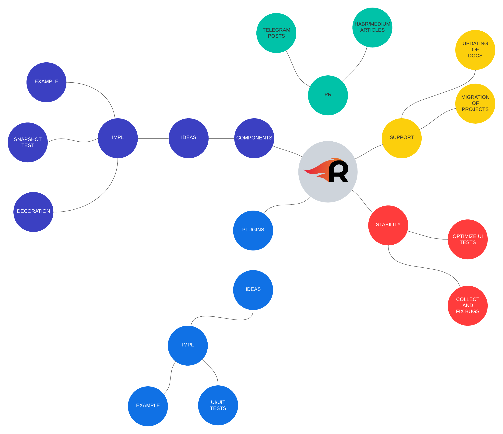

# Дорожная карта для 7.2

## Цели

### Доделать

-  Покрыть тестами всю логику

### Поддержать

- Создать канал для реакции на баги и консультацию по использованию
- Написать цикл публичных статей
- Поддерживать документацию

### Расширить

- Сделать спеку с типовыми ячейками

### Улучшить

- Добавить поддержку tvOs. Написать плагин для удобной конфигурации фокусировки элемента
- Добавить layoutCompositor для удобной композиции layout (CompositionalLayout)
- Добавить stackCompositor для удобной композиции нескольких стеков
- Добавить stackDecorator для регулировки отступов между view

# Дорожная карта для 8.0

## Цели

### Доделать

-  Выпилить Deprecated сущности

### Поддержать

- Рассказать студии. Поделиться планами
- Внедрять на новые проекты
- Продолжить цикл публичных статей
- Поддерживать документацию

### Расширить

- Написать новые плагины или подтянуть с проектов
- Сделать спеку с типовыми ячейками

### Улучшить

- Оптимизировать работу с секциями внутри ddm
- Оптимизировать поиск генераторов внутри ddm

## Ментальная карта

