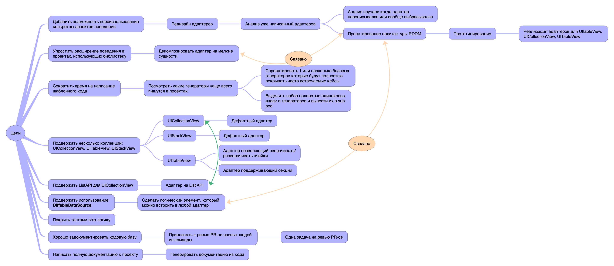

# Дорожная карта

## Цели

- Добавить возможность переиспользования конкретныx аспектов поведения. Например, если уже есть реализация сворчаивания, то можно взять роавно этот кусок логики и использвоать его в другом адаптере. 
- Упростить расширение поведения в проектах, использующих библиотеку. Например, если потребуется обрабатывать дополнительные события от коллекций, или обрабатывать их иначе, то разработчики не должны копировать/имплементировать половину/весь адаптер заново. Должно быть достаточно внести изменения в то место, которое нужно поменять
- Сократить время на написание шаблонного кода. Много времени уходит на написание однотипных генераторов. Необходимо посмотреть какие генераторы пишутся наиболее часто и написать 1 или несколько азовых генераторов.
- Поддержать несколько коллекций: UICollectionView, UITableView, UIStackView
- Поддержать ListAPI для UICollectionView
- Поддержать использование DiffKit-а
- Покрыть тестами всю логику
- Хорошо задокументировать кодовую базу
- Написать полную документацию к проекту

## Ментальная карта

