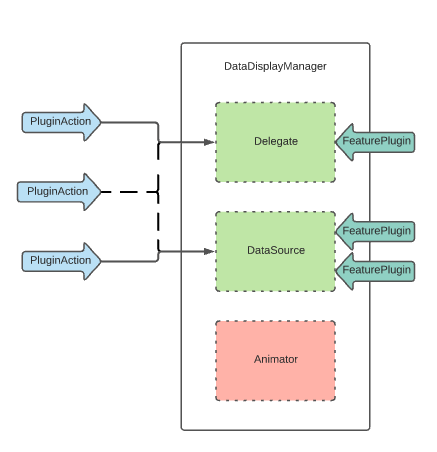

#  Описание идеи рефакторинга
<details>
Основной интерфейс управления оставляем без изменений для упрощения миграции
AbstractStateManager = DataDisplayManager и образует общий интерфейс

Делегат и data source выделяем в отдельные сущности
Простейшая модификация (например поддержка **SelectableItem** или **FoldableItem**) достигается за счет подключения плагинов.
Случаи сложнее реакции на ивент делегата добавляются за счет наследования от базового делегата.

Базовый класс наследуется от AbstractStateManager или DataDisplayManager и конкретизирует assotiatedtype - тем самым привязавшись к view (таблице, коллекции или стеку)
Базовый класс не расширяем. Дополнительную логику: вставка, удаление, замена и тп добавляем наследовавшись от базового класса.

Доступ к билдеру менеджера с делегатами и датасорсом реализуем через **DataDisplayCompatible**. Это образует nameSpace чтобы можно было билдить по-красоте,  например **tableView.rddm.somebuilder.addSmth.build**

TODO генераторы тоже должны быть составными. Попробовать прокачать базовый генератор так, чтобы минимизировать количество наследников. Тут больше подойдет декоратор нежели builder. Привязать его можно в статический nameSpace **UITableViewCell.rddm.genrator.selectable.foldable...**

TODO чтобы анимация вставки или замены не вызывала проблем - этот процесс выделим в **Animator** - который будет работать только с IndexPath и правильным образом обновлять таблицу, чтобы минимизировать возможные баги и дать возможность заменить аниматор.
</details>

## Сущности

Готовый **DataDisplayManager** может содержать в себе множество сущностей.  
По уровню сложности можем считать его организмом. Наследоваться от него потребуется в крайнем случае.



### PluginAction

- Атомарная единица. Основной инструмент при кастомизации.
- Описывает реакцию на событие коллекции.
- Имеет доступ до генераторов
- Собирается в **PluginCollection** - на одно событие может среагировать несколько плагинов

На основе этого можно проксировать события delegate или dataSource, добавить реакцию на нажатия для **SelectableItem**  или разворот по нажатию для **FoldableItem**.
Можно ознакомиться с готовыми плагинами в Example проекте.

#### Пример подключения

`tableView.rddm.baseBuilder.add(plugin: TableSelectablePlugin()).build()`

#### Пример реализации
```
public class TableSelectablePlugin: BaseTablePlugin<TableEvent> {

    public override init() {}

    public override func process(event: TableEvent, with manager: BaseTableManager?) {

        switch event {
        case .didSelect(let indexPath):
            guard let selectable = manager?.generators[indexPath.section][indexPath.row] as? SelectableItem else {
                return
            }
            selectable.didSelectEvent.invoke(with: ())

            if selectable.isNeedDeselect {
                manager?.view?.deselectRow(at: indexPath, animated: true)
            }
        default:
            break
        }
    }

}
```

### FeaturePlugin

- Атомарная единица. Основной инструмент при кастомизации.
- Представляет собой протокол для отдельной части dataSource или delegate.
- Интегрируется в единственном экземпляре

На основе этого типа сущности можно добавить поддержку перетаскивания ячеек, поддержку алфавитного указателя.
Когда фича требует задействование нескольких методов dataSource или delegate с возвращаемым значением - FeaturePlugin ваш выбор.

#### Пример подключения

`tableView.rddm.baseBuilder.set(plugin: TableMovablePlugin()).build()`

#### Пример реализации
TODO

### Delegate

- Молекула. Заменяется лишь когда не получилось кастомизировать плагинами.
- Реализует **UITableViewDelegate**
- Может содержать в себе **PluginCollection** и набор **FeaturePlugin**
- При модификации следует либо наследоваться от **BaseDelegate**, либо реализовать протокол **TableDelegate**. Обеспечив поддержку плагинов.

#### Пример подключения

`tableView.rddm.baseBuilder.set(delegate: YourCustomDelegate()).build()`

### DataSource

- Молекула. Заменяется лишь когда не получилось кастомизировать плагинами.
- Реализует **UITableViewDataSource** и **UITableViewDataSourcePrefetching**
- Может содержать в себе **PluginCollection** и набор **FeaturePlugin**
- При модификации следует либо наследоваться от **BaseDataSource**, либо реализовать протокол **TableDataSource**. Обеспечив поддержку плагинов.

#### Пример подключения

`tableView.rddm.baseBuilder.set(dataSource: YourCustomDataSource()).build()`


